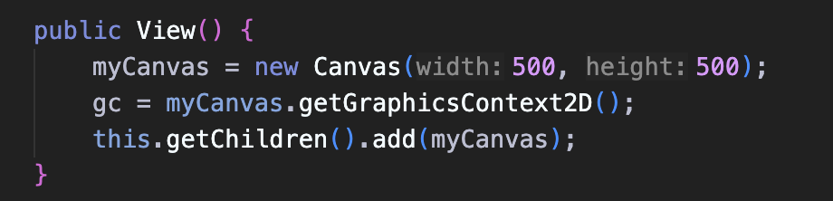

November 8, 2025:
- committing to keep the GitHub streak alive!! 

## November 11, 2025

**Patterns of Model**:

Logic: 
- having private attributes of array lists of entities and subscribers.
- Using the pub-sub pattern. Notifying listeners/subscribers upon updates.

Common Methods:
- create something, and notifies subscribers
- delete something, notify subscribers
- notifySubscribers(), where for each, you can call each `Subscriber` "update" method.
- contains and whichEntity method

**Patterns of View**

Logic: 
- always extends some Pane (StackPane) 
- can implement Subscriber? 
- Uses the attribute "Canvas"
- uses the attribute "GraphicsContext"
- A view that takes in the Controller as parameter. 

Common Methods:
- Constructor
- draw method containing a list of entities that calls the GraphicsContext instance to clear or setFill for reach thing.
- update methtodL that calls draw method again.

**Patterns of Controller**

Logic:
- takes the Model as an attribute

Common Methods:
- sets the Model by calling a method called "setMethod" with model param. We assign our attribute with the argument provided.
- handleMousePressed. event that calls upon model's methods
 
 **MainUI**
 - extends Region
 - calls all the Controller, views, models
 - call view's method of setupEvents
 - call model's add subscriber.
 - this.getChildren().add(view)

